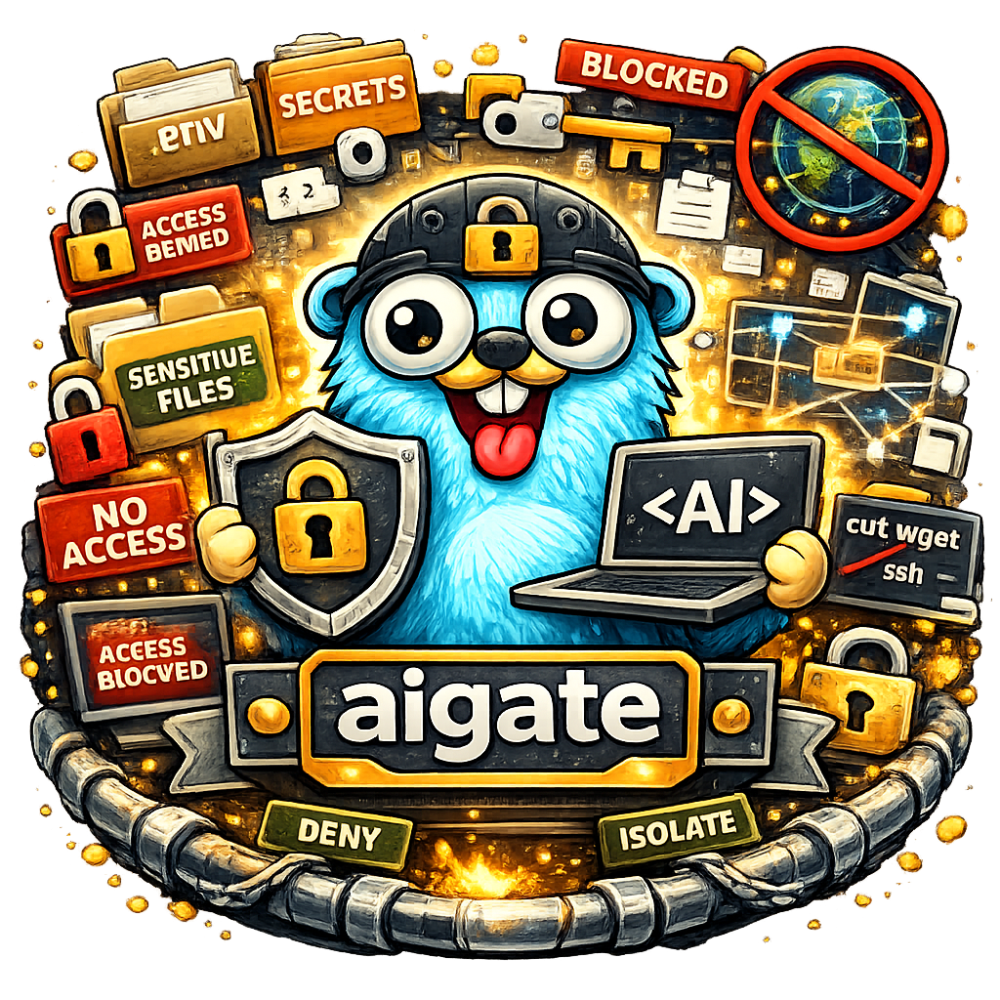
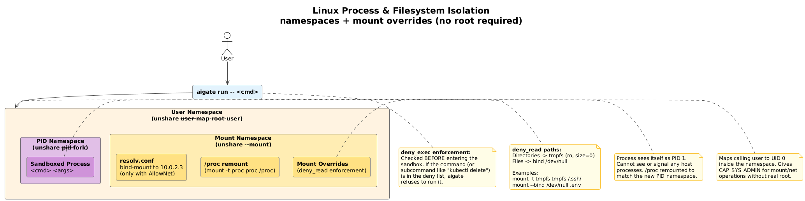

# aigate

<div align="center">
  
  <p>
    
    
    
  </p>
</div>

**OS-level sandbox for AI coding agents.** Kernel-enforced file, command, and network isolation for Claude Code, Cursor, Copilot, Aider, and any AI tool. Like a Python venv but for AI permissions.

## TL;DR

```sh
# Install
curl -L https://github.com/AxeForging/aigate/releases/latest/download/aigate-linux-amd64.tar.gz | tar xz
sudo mv aigate-linux-amd64 /usr/local/bin/aigate

# Initialize sandbox
sudo aigate init

# Add restrictions
aigate deny read .env secrets/ *.pem
aigate deny exec curl wget ssh

# Run any AI tool inside the sandbox
aigate run -- claude
aigate run -- cursor
```

## Why?

AI coding tools rely on application-level permission systems that can be bypassed. For GDPR/ISO/security-regulated companies, that's not enough. aigate uses the OS kernel as the trust boundary:

| Approach | Enforced by | Bypassable? |
|----------|-------------|-------------|
| .claudeignore | App | Yes (proven broken) |
| permissions.deny | App | Theoretically |
| **aigate (ACLs + namespaces)** | **Kernel** | **No** |

## Features

- **File isolation** - POSIX ACLs (Linux) / macOS ACLs deny read access to secrets
- **Process isolation** - Mount namespaces overmount sensitive directories (Linux)
- **Network isolation** - Network namespaces restrict egress to allowed domains (Linux)
- **Command blocking** - Deny execution of dangerous commands (curl, wget, ssh)
- **Resource limits** - cgroups v2 enforce memory, CPU, PID limits (Linux)
- **Tool-agnostic** - Works with any AI tool: Claude Code, Cursor, Copilot, Aider
- **Sensible defaults** - Ships with deny rules for .env, secrets/, .ssh/, *.pem, etc.
- **Project-level config** - `.aigate.yaml` extends global rules per project

## Documentation

| Audience | Link |
|----------|------|
| **Users** | [docs/user/README.md](docs/user/README.md) - Installation, usage, examples |
| **AI Assistants** | [docs/AI/README.md](docs/AI/README.md) - Architecture, testing, common tasks |

---

## Commands

```sh
aigate init                                 # Create sandbox group/user/config
aigate deny read .env secrets/ *.pem        # Block file access
aigate deny exec curl wget ssh              # Block commands
aigate deny net --except api.anthropic.com  # Restrict network
aigate allow read .env                      # Remove a deny rule
aigate run -- claude                        # Run AI tool in sandbox
aigate status                               # Show current rules
aigate reset --force                        # Remove everything
```

## How It Works



See [docs/user/README.md](docs/user/README.md) for detailed architecture diagrams covering file isolation, network isolation (Linux & macOS), and process isolation.

## Configuration

Global config (`~/.aigate/config.yaml`) is created by `aigate init` with defaults. Extend per-project with `.aigate.yaml`:

```yaml
# .aigate.yaml (in project root)
deny_read:
  - "terraform.tfstate"
  - "vault-token"
allow_net:
  - "registry.terraform.io"
```

## Exit Codes

| Code | Meaning |
|------|---------|
| 0 | Success |
| 1 | Error |

## License

MIT - see [LICENSE](LICENSE)
