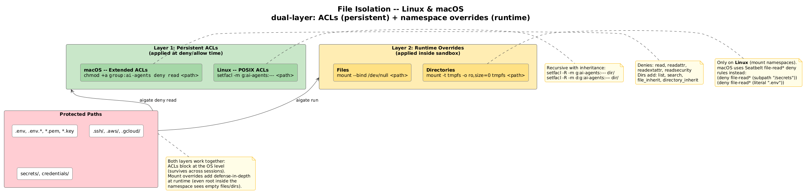
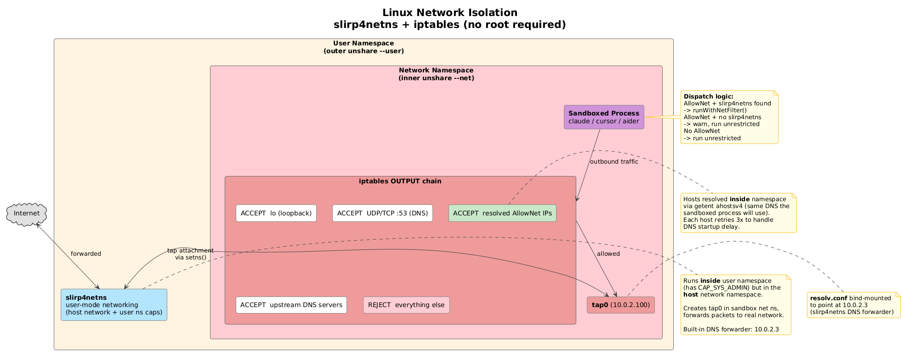
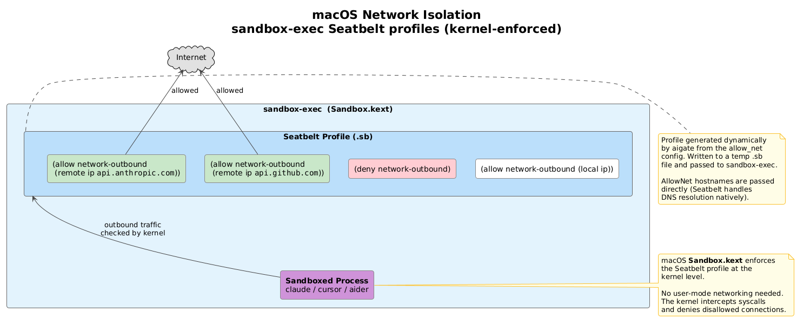

# aigate User Guide

## What is aigate?

aigate creates an OS-level sandbox for AI coding agents. When you use Claude Code, Cursor, Copilot, or any AI tool, aigate ensures they cannot:

- **Read** your secrets (.env, credentials, SSH keys, cloud configs)
- **Execute** dangerous commands (curl, wget, ssh)
- **Access** unauthorized network endpoints

Unlike application-level restrictions that can be bypassed, aigate uses kernel-enforced isolation (Linux namespaces + iptables, macOS sandbox-exec). The AI tool physically cannot access what you deny.

## Prerequisites

| | Linux | macOS |
|---|---|---|
| **Required** | `setfacl` (usually pre-installed) | None (uses built-in sandbox-exec) |
| **For network filtering** | `slirp4netns` | None (uses built-in Seatbelt) |

Install `slirp4netns` on Linux if you use `allow_net`:

```sh
# Fedora / RHEL
sudo dnf install slirp4netns

# Ubuntu / Debian
sudo apt install slirp4netns

# Arch
sudo pacman -S slirp4netns
```

If `slirp4netns` is not installed, aigate logs a warning and runs without network filtering.

## Install

### Linux/macOS (AMD64)
```sh
curl -L https://github.com/AxeForging/aigate/releases/latest/download/aigate-linux-amd64.tar.gz | tar xz
chmod +x aigate-linux-amd64
sudo mv aigate-linux-amd64 /usr/local/bin/aigate
```

### Linux/macOS (ARM64 / Apple Silicon)
```sh
# Linux
curl -L https://github.com/AxeForging/aigate/releases/latest/download/aigate-linux-arm64.tar.gz | tar xz
sudo mv aigate-linux-arm64 /usr/local/bin/aigate

# macOS
curl -L https://github.com/AxeForging/aigate/releases/latest/download/aigate-darwin-arm64.tar.gz | tar xz
sudo mv aigate-darwin-arm64 /usr/local/bin/aigate
```

### From Source (Go 1.24+)
```sh
go install github.com/AxeForging/aigate@latest
```

## Quick Start

```sh
# 1. System setup (creates OS group + user, requires sudo)
sudo aigate setup

# 2. Create default config
aigate init

# 3. Add custom restrictions
aigate deny read .env secrets/ terraform.tfstate
aigate deny exec curl wget ssh

# 4. Run your AI tool inside the sandbox
aigate run -- claude
aigate run -- cursor
aigate run -- aider
```

## Commands

### setup

Creates the OS group (`ai-agents`) and user (`ai-runner`). Requires `sudo`. Safe to re-run (skips existing group/user).

```sh
sudo aigate setup                                # Default group/user
sudo aigate setup --group mygroup --user myuser  # Custom names
```

### init

Creates default config at `~/.aigate/config.yaml`. Does not require sudo.

```sh
aigate init                    # Create default config
aigate init --force            # Re-create config (overwrites existing)
```

### deny

Add restrictions. Three sub-commands:

```sh
# Block file/directory access
aigate deny read .env secrets/ *.pem .aws/

# Block command execution
aigate deny exec curl wget nc ssh scp

# Block specific subcommands (allow other uses of the command)
aigate deny exec "kubectl delete" "kubectl create" "docker rm"

# Restrict network (only allow specific domains)
aigate deny net --except api.anthropic.com --except api.openai.com
```

### allow

Remove restrictions:

```sh
aigate allow read .env          # Remove .env from deny list
aigate allow exec curl          # Allow curl again
aigate allow exec "kubectl delete"  # Allow kubectl delete again
aigate allow net example.com    # Add allowed domain
```

### run

Execute any command inside the sandbox:

```sh
aigate run -- claude                       # Claude Code
aigate run -- cursor                       # Cursor AI
aigate run -- aider --model claude-3       # Aider
aigate run -- echo "test"                  # Any command
```

### status

Show current sandbox configuration:

```sh
aigate status
```

### reset

Remove everything (group, user, config):

```sh
sudo aigate reset --force
```

## Configuration

### Global Config (~/.aigate/config.yaml)

Created automatically by `aigate init` with sensible defaults:

```yaml
group: ai-agents
user: ai-runner
deny_read:
  - ".env"
  - ".env.*"
  - "secrets/"
  - "credentials/"
  - "~/.ssh/"
  - "*.pem"
  - "*.key"
  - "~/.aws/"
  - "~/.gcloud/"
  - "~/.kube/config"
  - "~/.npmrc"
  - "~/.pypirc"
deny_exec:
  - "curl"
  - "wget"
  - "nc"
  - "ssh"
  - "scp"
  - "kubectl delete"
  - "kubectl exec"
allow_net:
  - "api.anthropic.com"
  - "api.openai.com"
  - "api.github.com"
resource_limits:
  max_memory: "4G"
  max_cpu_percent: 80
  max_pids: 1000
```

### Project Config (.aigate.yaml)

Place in your project root to extend global rules:

```yaml
deny_read:
  - "terraform.tfstate"
  - "vault-token"
allow_net:
  - "registry.terraform.io"
resource_limits:
  max_memory: "8G"
```

Project config merges with global (extends, does not replace).

## How It Works

Architecture diagrams are in [`docs/diagrams/`](../diagrams/).

### File isolation

Two layers working together for defense-in-depth:

1. **Persistent ACLs** (applied when you run `aigate deny read`):
   - **Linux**: POSIX ACLs via `setfacl` deny the `ai-agents` group read access
   - **macOS**: Extended ACLs via `chmod +a` with explicit deny entries
2. **Runtime overrides** (applied when you run `aigate run`):
   - **Linux**: Mount namespaces overmount directories with empty tmpfs, files with `/dev/null`
   - **macOS**: Seatbelt `file-read*` deny rules in the sandbox profile



### Network isolation

Restricts outbound connections to domains listed in `allow_net`:

- **Linux**: User namespace + network namespace + `slirp4netns` for user-mode networking + `iptables` OUTPUT rules. Hostnames are resolved inside the namespace so iptables IPs match what the sandboxed process sees. Requires `slirp4netns` (falls back to unrestricted if not installed). No root needed.
- **macOS**: `sandbox-exec` Seatbelt profiles with `(deny network-outbound)` and per-host `(allow network-outbound (remote ip ...))` rules. Kernel-enforced via Sandbox.kext.

**Linux**:



**macOS**:



### Process isolation (Linux)

- **User namespace**: Maps calling user to UID 0 inside the namespace, giving capabilities for mount/net operations without real root
- **PID namespace**: Sandboxed process sees itself as PID 1, cannot see or signal host processes. `/proc` is remounted to match
- **Mount namespace**: Enables filesystem overrides without affecting the host


### Command blocking

`deny_exec` rules are enforced at two layers for defense-in-depth:

1. **Pre-sandbox check**: Before entering the sandbox, aigate checks the command (and subcommands like `kubectl delete`) against the deny list and refuses to launch blocked commands.
2. **Kernel-level enforcement inside the sandbox**:
   - **Linux**: Full command blocks use `mount --bind` to overlay denied binaries with a deny script. Subcommand blocks use wrapper scripts that check arguments before forwarding to the original binary.
   - **macOS**: Full command blocks use Seatbelt `(deny process-exec)` rules enforced by Sandbox.kext. Subcommand blocks rely on the pre-sandbox check.

### Resource limits

cgroups v2 enforce memory, CPU, and PID limits (Linux only).

## Troubleshooting

### "operation requires elevated privileges"
`setup` and `reset` need `sudo` to create/delete OS users and groups. `init`, `deny`, `allow`, `run`, and `status` do not.

### ACL warnings on deny/allow
If you see "Failed to apply ACLs", the AI agent group may not exist yet. Run `sudo aigate setup` first.

### "aigate not initialized"
Run `sudo aigate setup` to create the sandbox group and user, then `aigate init` to create the default config.

### "slirp4netns not found" warning
Install `slirp4netns` for network filtering on Linux (see [Prerequisites](#prerequisites)). Without it, `allow_net` rules are ignored and the sandboxed process has unrestricted network access.

### Allowed hosts still blocked
If hosts in `allow_net` are being rejected, DNS inside the sandbox may not have been ready in time. Check that `slirp4netns` is installed and working. Run with `AIGATE_LOG_LEVEL=debug` for detailed output.

## Exit Codes

| Code | Meaning |
|------|---------|
| 0 | Success |
| 1 | Error (invalid args, missing config, blocked command, etc.) |
